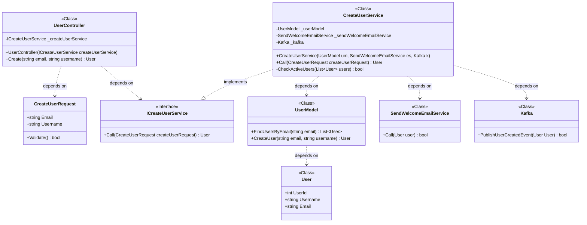
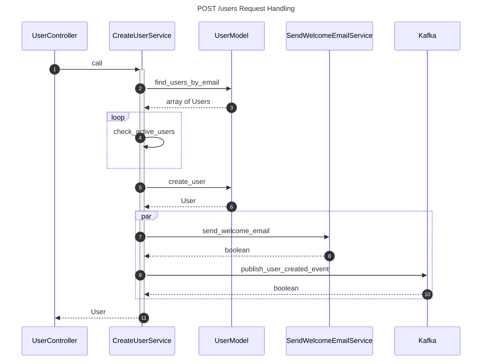
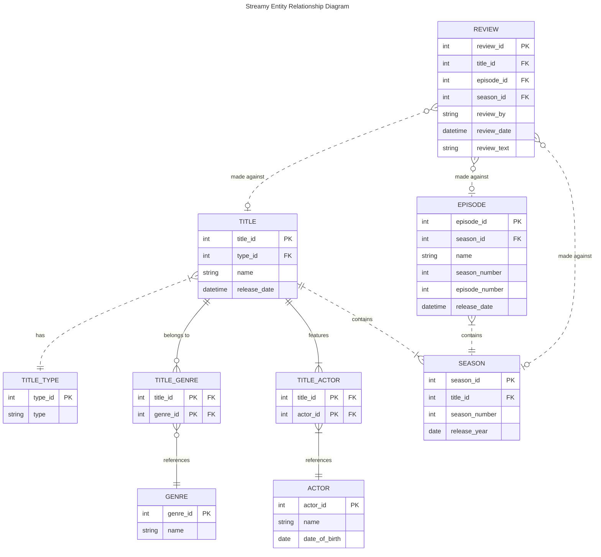
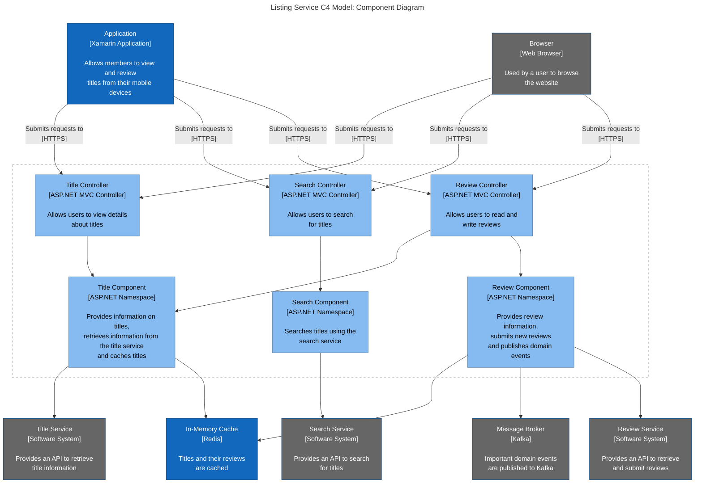
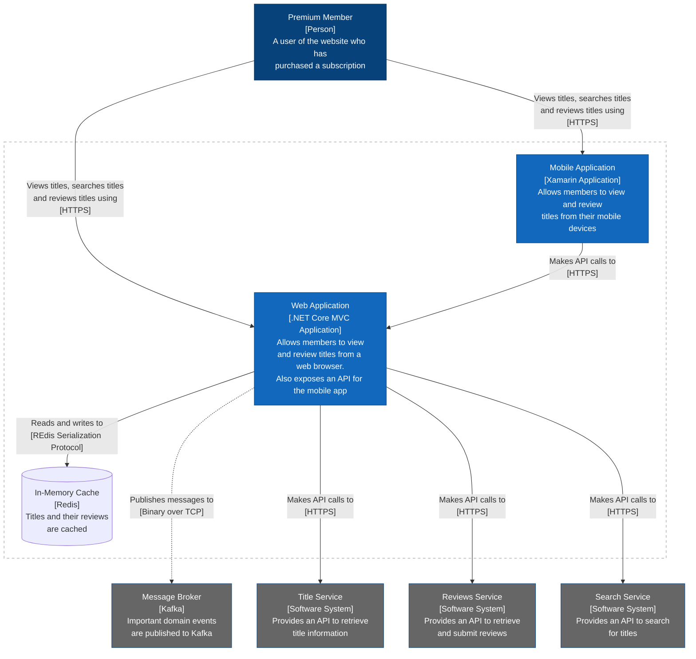
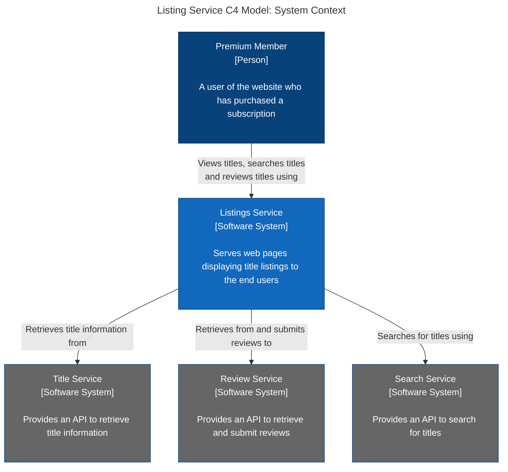
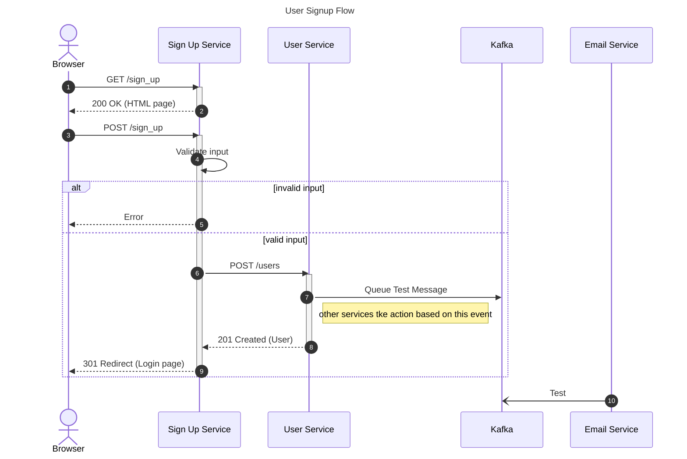
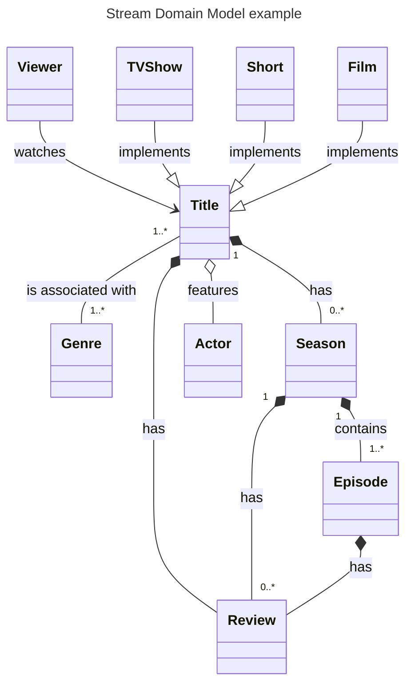
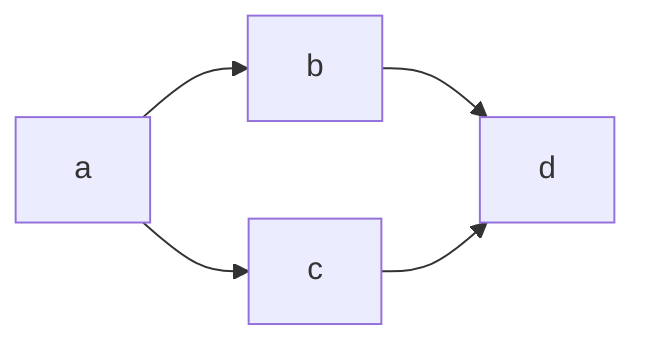

```


```





```


```




```


```




```


```




```


```




```


```



```


```




```


```




> test


# test

*blah*

- this is 
- that is 

`my code goes here`

```
this is also clode
blah blah
```
